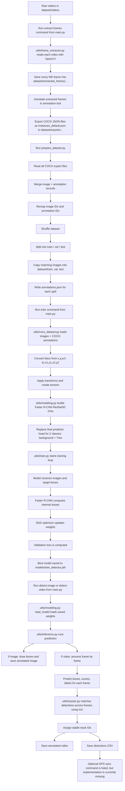

```mermaid
flowchart TD
    A["Raw videos in dataset/videos"] --> B["Run extract-frames command from main.py"]
    B --> C["utils/frame_extractor.py reads each video with OpenCV"]
    C --> D["Save every Nth frame into dataset/extracted_frames/..."]

    D --> E["Annotate extracted frames in annotation tool"]
    E --> F["Export COCO JSON files as instances_default.json in dataset/exports/..."]

    F --> G["Run prepare_dataset.py"]
    G --> H["Read all COCO export files"]
    H --> I["Merge image + annotation records"]
    I --> J["Remap image IDs and annotation IDs"]
    J --> K["Shuffle dataset"]
    K --> L["Split into train / val / test"]
    L --> M["Copy matching images into dataset/train, val, test"]
    M --> N["Write annotations.json for each split"]

    N --> O["Run train command from main.py"]
    O --> P["utils/coco_dataset.py loads images + COCO annotations"]
    P --> Q["Convert bbox from x,y,w,h to x1,y1,x2,y2"]
    Q --> R["Apply transforms and create tensors"]

    R --> S["utils/modeling.py builds Faster R-CNN ResNet50 FPN"]
    S --> T["Replace final predictor head for 2 classes: background + Tree"]

    T --> U["utils/train.py starts training loop"]
    U --> V["Model receives images and target boxes"]
    V --> W["Faster R-CNN computes internal losses"]
    W --> X["SGD optimizer updates weights"]
    X --> Y["Validation loss is computed"]
    Y --> Z["Best model saved to models/tree_detector.pth"]

    Z --> AA["Run detect-image or detect-video from main.py"]
    AA --> AB["utils/modeling.py load_model loads saved weights"]
    AB --> AC["utils/inference.py runs prediction"]

    AC --> AD["If image: draw boxes and save annotated image"]
    AC --> AE["If video: process frame by frame"]
    AE --> AF["Predict boxes, scores, labels for each frame"]
    AF --> AG["utils/tracker.py matches detections across frames using IoU"]
    AG --> AH["Assign stable track IDs"]
    AH --> AI["Save annotated video"]
    AH --> AJ["Save detections CSV"]

    AJ --> AK["Optional GPS sync command is listed, but implementation is currently missing"]
```